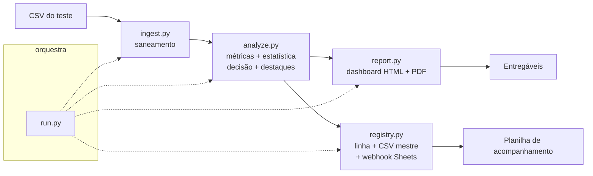

# Growth AI-Native | Méliuz

Solução reutilizável para análise de testes A/B de cashback. Recebe o CSV de um teste, saneia os dados, calcula métricas de negócio, valida a diferença estatisticamente, produz um dashboard e um relatório apresentáveis, e registra o teste numa planilha de acompanhamento — respondendo à pergunta:

> **Dado este teste A/B, qual variante de cashback devemos escalar para 100% do tráfego?**

A mesma solução processa qualquer parceiro, período ou número de variantes **sem alteração de código** — basta indicar o arquivo.

---

## 1. Resultados 

| Parceiro | Período | Variantes | Decisão | Confiança | Destaque analítico |
|---|---|---|---|---|---|
| **A** | jan–abr 2011 | 3 | **Escalar Grupo 1** | Alta | Trade-off: o Grupo 3 tem o maior GMV, mas o Grupo 1 é mais lucrativo (abre-se mão de R$ 8,41 de GMV por R$ 1,00 de lucro) |
| **B** | mai–jun 2011 | 3 | **Escalar Grupo 1** | Alta | Resposta clara ao cashback: quanto maior o incentivo, menor a rentabilidade (Grupo 3 com ROI de apenas 0,22) |
| **C** | jul–ago 2011 | 2 | **Escalar Grupo 1** | Alta | Exceção crítica: o Grupo 2 devolve 100% da comissão em cashback e opera com **lucro zero** |

Em todos os três, a variante de **menor cashback (Grupo 1)** foi a mais rentável, com diferença estatisticamente consistente ao longo dos dias.

---

## 2. Como usar

A solução é uma **skill** (`ab-cashback-analyzer`) — um pacote de instruções + scripts que uma ferramenta de IA (Claude) aciona em linguagem natural.

**Opção A — linguagem natural (uso pretendido).** Com a skill instalada, basta anexar o CSV e pedir:

> *"Analisa esse teste de cashback do Parceiro D."*

A skill dispara sozinha, roda o pipeline completo e devolve a recomendação, o dashboard, o relatório e a linha de registro.

**Opção B — linha de comando (determinística).**

```bash
cd ab-cashback-analyzer/scripts
python run.py --csv <ARQUIVO.csv> --nome "Nome do teste" \
              --descricao "Descrição curta" \
              --out <dir_saida> --master registro_mestre.csv
```

Saída: `dashboard_*.html` (interativo), `relatorio_*.pdf` (2 páginas), `analise_*.json`, e uma linha acrescentada ao `registro_mestre.csv`.

**Requisitos:** Python 3.12+, `pandas`, `numpy`, `scipy`, `matplotlib`, `reportlab`. Os três datasets do enunciado rodam sem qualquer alteração de código.

---

## 3. Arquitetura da solução

### Por que uma *skill*

O enunciado pede algo *reutilizável e acionável por qualquer pessoa do time, em linguagem natural*. Uma skill entrega exatamente isso: é **parametrizada** (descobre parceiro, período e variantes lendo o arquivo), **acionável em linguagem natural** (dispara pela intenção, sem comando decorado), e **compartilhável** — empacotada como um único arquivo `.skill` que qualquer pessoa instala no próprio perfil. A lógica pesada fica em scripts Python versionados, e a skill orquestra.

### Pipeline



### Papel de cada script

| Script | Responsabilidade |
|---|---|
| `run.py` | Orquestrador e ponto de entrada único; encadeia todo o fluxo. |
| `ingest.py` | Leitura e **saneamento** robusto; produz o relatório de qualidade. |
| `analyze.py` | Métricas de negócio, **validação estatística** (bootstrap), decisão, **destaques automáticos** e curva de resposta ao cashback. |
| `report.py` | **Dashboard HTML** interativo (Chart.js) e **relatório PDF** de 2 páginas. |
| `registry.py` | Monta a linha de registro, mantém o **CSV mestre** e envia ao **webhook** da planilha. |

As referências em `references/` documentam as métricas, a regra de decisão e o catálogo de qualidade, e são consultadas pela skill quando precisa justificar uma escolha.

### Reutilização e parametrização

Nada é fixo por parceiro. O número de variantes, o período e os nomes vêm do arquivo. Os rótulos de coluna são mapeados por sinônimos (tolerando acento, caixa e espaços), e toda a análise se adapta a 2, 3 ou mais variantes. Instalada uma vez, a skill vale para todos os testes futuros.

---

## 4. Robustez a dados ruins

Princípio central: **o arquivo é sempre tratado como potencialmente sujo, e nunca imputamos valores.** Cada linha que não passa numa checagem é **descartada** (defeito que invalida a linha) ou posta em **quarentena** (suspeita, isolada da análise mas preservada), com o motivo registrado — porque quem decide precisa saber em que fração dos dados a decisão se apoia.

O saneamento trata: encoding variável (utf-8 / utf-8-sig / latin-1), separador `;` ou `,`, moeda em formato brasileiro (`R$ 1.234,56`), campos vazios, datas inválidas, valores negativos, inconsistências lógicas (cashback > GMV), duplicatas, rótulos com erro de digitação (`Gurpo 2` → `Grupo 2`), grupos fantasma (volume irrisório) e linhas fora de ordem.

**Prova:** um dataset foi propositalmente corrompido (latin-1, separador `;`, 9 defeitos injetados). A ferramenta aproveitou 56 de 61 linhas (91,8%), capturou cada defeito na categoria certa e — corretamente — devolveu veredito **INCONCLUSIVO**, em vez de fingir confiança sobre dados ruins. Um "inconclusivo" honesto vale mais que um falso positivo.

---

## 5. Abordagem analítica

### Métrica de decisão

**Lucro = comissão − cashback.** A variante recomendada é a de maior **lucro por comprador** — métrica normalizada que não depende do volume de tráfego que cada variante recebeu.

### Por que estatística, e não só "quem lucrou mais"

"O Grupo X lucrou mais" é uma observação, não uma decisão. Diferenças diárias têm variabilidade natural. A ferramenta usa **bootstrap** (semente fixa, reprodutível) sobre a série diária de lucro por comprador para calcular o intervalo de confiança de 95% da diferença entre a 1ª e a 2ª colocada: se o intervalo não cruza zero, a vantagem é consistente; se cruza, o veredito passa a **INCONCLUSIVO**.

### Sem denominador de exposição

O CSV traz `compradores` (numerador), mas não quantos usuários foram **expostos** a cada variante. Logo, **taxa de conversão é impossível de calcular** e o teste clássico de proporções fica indisponível. A solução assume alocação de tráfego equilibrada, usa o **dia como unidade amostral** e ancora a decisão em métricas normalizadas. Essa limitação é declarada em toda análise, em vez de mascarada.

### Trade-off crescimento × margem

Quando a variante mais lucrativa não é a de maior GMV (caso do Parceiro A), a ferramenta abre uma seção de **trade-off**: quantifica quanto de GMV se abre mão por real de lucro ganho (R$ 8,41 por R$ 1,00) e devolve a escolha ao gestor, sem esconder o conflito atrás de um "vencedor" único.

### Destaques automáticos (leitura crítica)

A ferramenta detecta e escreve, sozinha, os achados que exigiriam um analista experiente: variante com lucro nulo (Parceiro C), ROI abaixo de 1 (cashback que não se paga), o padrão dose-resposta do cashback, efeito de novidade e grupos fantasma. O objetivo é levar exceções à superfície, não deixá-las implícitas nos números.

---

## 6. Análises e achados por parceiro

**Parceiro A — o trade-off.** O Grupo 1 lidera em rentabilidade (lucro R$ 404.711, ROI 1,73, margem 7,2%, R$ 41,66 de lucro por comprador). Mas o Grupo 3, de maior cashback, tem o maior **GMV** (R$ 6,79M) — atrai mais volume à custa de margem (lucro cai para R$ 264.287, ROI 0,52). É a decisão crescimento × margem, quantificada e entregue ao gestor.

**Parceiro B — resposta limpa ao cashback.** Sem trade-off: o Grupo 1 vence em tudo. A rentabilidade cai monotonicamente com o incentivo — lucro por comprador de R$ 35,74 (G1) → R$ 26,28 (G2) → R$ 10,48 (G3), com o ROI do Grupo 3 despencando para 0,22. Mais cashback aqui é puro custo.

**Parceiro C — a exceção.** O Grupo 2 **devolve 100% da comissão em cashback e opera com lucro zero** (ROI 0,00) — uma variante economicamente inviável, sinalizada automaticamente. O Grupo 1 é o único caminho rentável (R$ 7,65 de lucro por comprador).

---

## 7. Atendimento às restrições do enunciado

| Requisito | Como foi atendido |
|---|---|
| Solução reutilizável e parametrizada | Skill + scripts; descobre parceiro/período/variantes do arquivo |
| Acionável em linguagem natural | A skill dispara pela intenção do usuário |
| Processa os 3 datasets sem mudar código | Mesmo `run.py`, só troca o `--csv` |
| Robusta a dados ruins | Saneamento com descarte/quarentena; provado em dataset corrompido |
| Pergunta central respondida | Decisão de qual variante escalar, com confiança |
| Relatório apresentável para gestor | PDF de 2 páginas + dashboard interativo |
| Registro em planilha (1 linha/teste) | Google Sheets + CSV mestre, com nome, descrição, resultado e decisão |
| Escrita no Sheets (diferencial) | Criação via conector do Drive; append automático via webhook (Apps Script) |
| README de como rodar | Este documento |

---

## 8. Premissas e limitações

- **Sem grupo de controle:** as variantes são comparadas entre si, não contra um baseline.
- **Sem denominador de exposição:** taxa de conversão não é calculável; a inferência usa o dia como unidade amostral e métricas normalizadas.
- **Premissa de alocação equilibrada** de tráfego entre variantes, declarada em toda análise.
- A validação estatística supõe independência entre dias; efeitos de calendário fortes (feriados, campanhas) não são modelados explicitamente, mas o efeito de novidade é checado.

---

## 9. Estrutura do repositório

```
growth-ai-native-meliuz/
├── README.md
├── ab-cashback-analyzer.skill          # skill empacotada (instalável e compartilhável)
├── ab-cashback-analyzer/               # código-fonte da skill
│   ├── SKILL.md                        # instruções e gatilho
│   ├── scripts/
│   │   ├── run.py                      # orquestrador (ponto de entrada)
│   │   ├── ingest.py                   # saneamento + relatório de qualidade
│   │   ├── analyze.py                  # métricas, estatística, decisão, destaques
│   │   ├── report.py                   # dashboard HTML + relatório PDF
│   │   └── registry.py                 # CSV mestre + webhook da planilha
│   ├── references/                     # métricas, regras de decisão, qualidade
│   └── assets/
│       └── apps_script_webhook.gs      # webhook opcional para append no Sheets
└── entregaveis/
    ├── RELATORIOS_A_B_C.pdf            # 3 relatórios num PDF
    ├── DASHBOARDS_A_B_C.pdf           # 3 dashboards num PDF
    ├── dashboard_*.html               # dashboards interativos (por parceiro)
    ├── relatorio_*.pdf                # relatórios (por parceiro)
    └── registro_mestre.csv            # histórico consolidado (fonte de verdade)
```

---

## 10. Planilha de acompanhamento

Cada teste vira uma linha no `registro_mestre.csv` (a fonte de verdade) e na planilha Google Sheets. Como o conector cria a planilha mas não edita células de uma já existente, o append contínuo com **link fixo** é feito por um Web App de Google Apps Script (`assets/apps_script_webhook.gs`): a solução envia a linha por POST e o script a acrescenta na planilha, preservando o mesmo link.

**Link da planilha:** _ https://docs.google.com/spreadsheets/d/1j5qx0ajboaMENpNNLaj0aN5xUcz_IMQr32Pf-XdD3bI/edit?usp=sharing _

---


